# WirexApp Architecture Documentation

## Table of Contents
- [System Overview](#system-overview)
- [Architecture Patterns](#architecture-patterns)
- [Component Diagram](#component-diagram)
- [Data Flow](#data-flow)
- [Deployment](#deployment)
- [CI/CD Pipeline](#cicd-pipeline)

## System Overview

WirexApp is a **multi-currency payment processing platform** that handles cross-currency transactions with real-time exchange rates. Built with a modular monolith architecture, implementing CQRS, Event Sourcing, and CDC patterns for scalability and reliability.

**Core Features:**
- Multi-currency payment processing
- Real-time currency conversion with exchange rates
- User account management with bonus system
- Payment status tracking and notifications
- Event-driven architecture for data synchronization

### High-Level Architecture

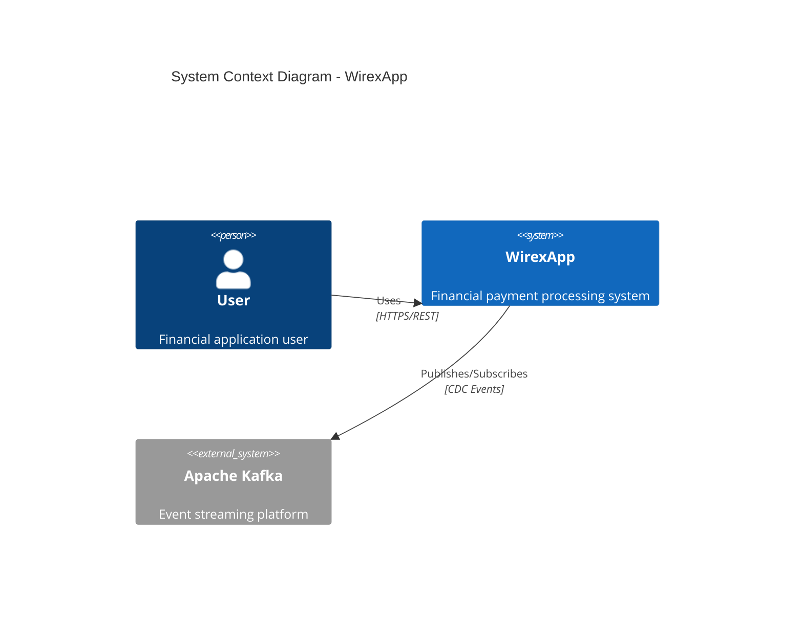

## Architecture Patterns

### 1. CQRS (Command Query Responsibility Segregation)

**Write Side (Commands)**:
- Handles state-changing operations
- Uses Event Sourcing for persistence
- Stores events in Event Store
- Publishes CDC events via Outbox Pattern

**Read Side (Queries)**:
- Handles read-only operations
- Uses denormalized views for performance
- Implements caching strategies
- Updated automatically via CDC consumers

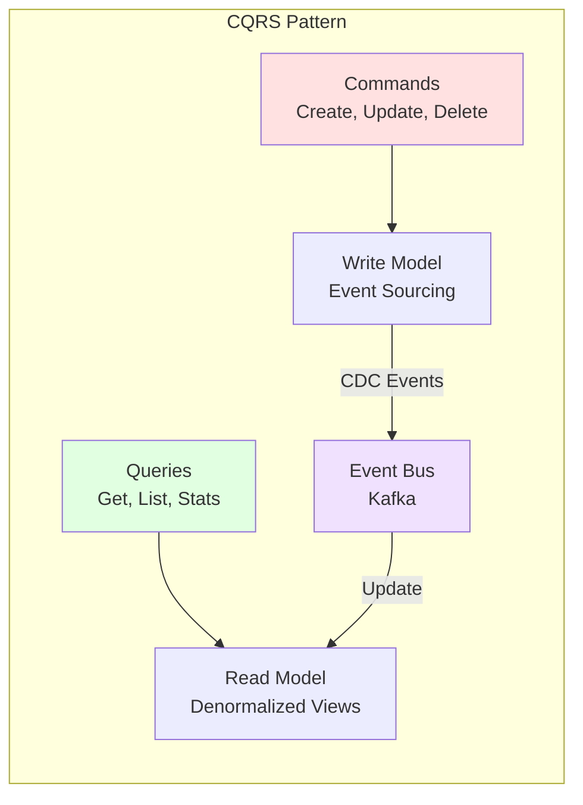

### 2. Event Sourcing

All state changes are stored as a sequence of events.

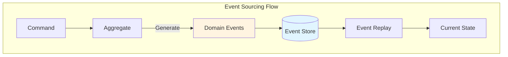

**Benefits**:
- Complete audit trail
- Time travel debugging
- Event replay for state reconstruction
- Immutable event history

### 3. Outbox Pattern

Ensures reliable event delivery with transactional consistency.

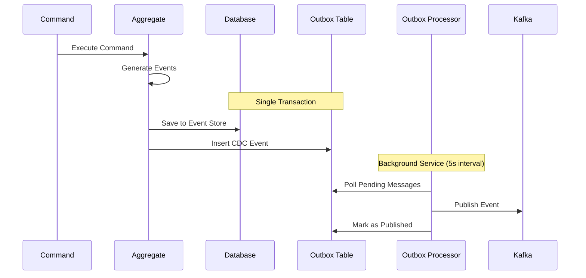

**Key Features**:
- Atomic write to database and outbox
- At-least-once delivery guarantee
- Retry mechanism with exponential backoff
- No message loss during Kafka downtime

### 4. Change Data Capture (CDC)

Automatically synchronizes Write and Read models.

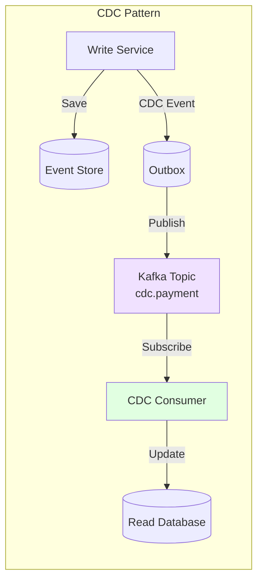

**CDC Event Structure**:
```json
{
  "entityType": "Payment",
  "operation": "Create | Update | Delete",
  "data": { /* entity data */ },
  "timestamp": "2026-02-09T18:30:00Z",
  "version": 1
}
```

## Component Diagram

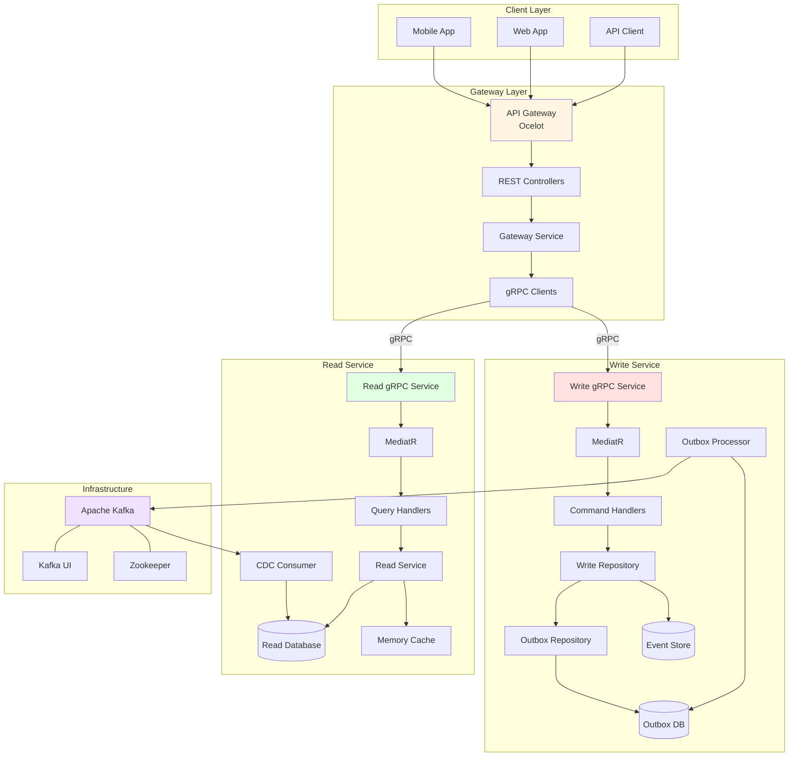

## Data Flow

### Write Flow (Command Processing)

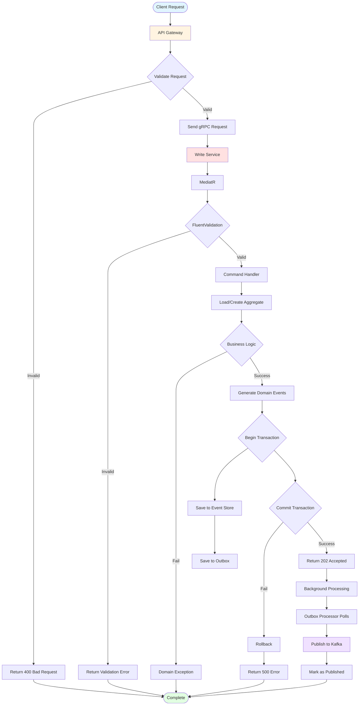

### Read Flow (Query Processing)

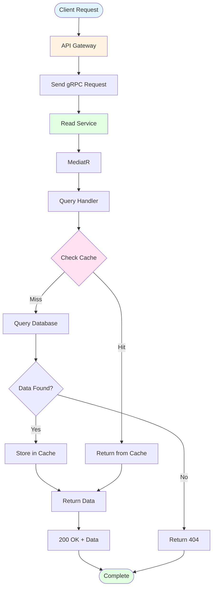

### CDC Synchronization Flow

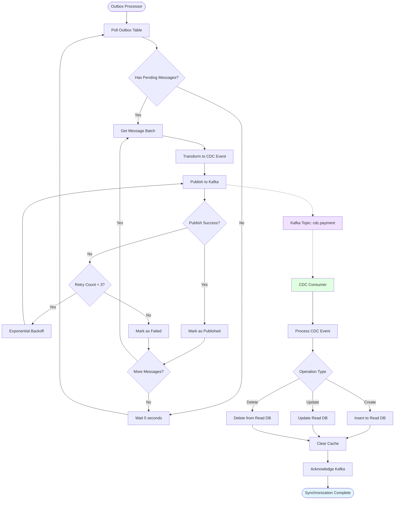

## Deployment

### Docker Compose Deployment

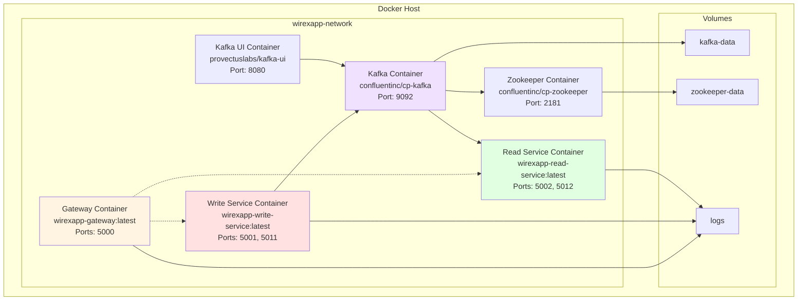

### Health Checks

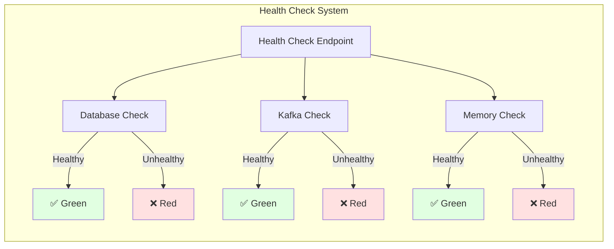

## CI/CD Pipeline

```mermaid
graph TB
    subgraph "Source Control"
        GitHub[GitHub Repository]
        PR[Pull Request]
        Push[Push to Main]
    end

    subgraph "GitHub Actions - CI"
        Trigger{Trigger Event}
        Checkout[Checkout Code]

        subgraph "Build & Test"
            Restore[Restore Dependencies]
            Build[Build .NET Projects]
            Test[Run Tests]
            Validate[Code Analysis]
        end

        subgraph "Security Scanning"
            DepScan[Dependency Scan]
            SecretScan[Secret Detection]
            ImageScan[Docker Image Scan]
            LicenseScan[License Compliance]
        end
    end

    subgraph "GitHub Actions - CD"
        subgraph "Docker Build"
            BuildGW[Build Gateway Image]
            BuildWS[Build Write Service]
            BuildRS[Build Read Service]
        end

        Push_Registry[Push to GHCR]
        Tag[Tag Images]
    end

    subgraph "Deployment"
        Deploy{Deployment Type}
        Auto[Auto Deploy to Prod]
        Manual[Manual Deploy]

        SSH[SSH to Server]
        Pull[Pull Images]
        Compose[Docker Compose Up]
        HealthCheck[Health Checks]
        Rollback{Success?}
    end

    subgraph "Container Registry"
        GHCR[GitHub Container Registry<br/>ghcr.io]
    end

    GitHub --> Trigger
    PR --> Trigger
    Push --> Trigger

    Trigger --> Checkout
    Checkout --> Restore
    Restore --> Build
    Build --> Test
    Test --> Validate

    Validate --> DepScan
    DepScan --> SecretScan
    SecretScan --> ImageScan
    ImageScan --> LicenseScan

    LicenseScan -->|Success| BuildGW
    BuildGW --> BuildWS
    BuildWS --> BuildRS
    BuildRS --> Tag
    Tag --> Push_Registry
    Push_Registry --> GHCR

    GHCR --> Deploy
    Deploy --> Auto
    Deploy --> Manual

    Auto --> SSH
    Manual --> SSH
    SSH --> Pull
    Pull --> Compose
    Compose --> HealthCheck
    HealthCheck --> Rollback

    Rollback -->|Success| Complete([✅ Deployed])
    Rollback -->|Failure| RollbackAction[Rollback Previous Version]
    RollbackAction --> Failed([❌ Failed])

    style GitHub fill:#e1f5ff
    style BuildGW fill:#fff4e1
    style BuildWS fill:#ffe1e1
    style BuildRS fill:#e1ffe1
    style GHCR fill:#f0e1ff
    style Complete fill:#e1ffe1
    style Failed fill:#ffe1e1
```

### CI/CD Workflow Files

1. **ci-cd.yml** - Main CI/CD pipeline
   - Triggers on push to main/master/develop
   - Builds and tests all services
   - Creates Docker images
   - Pushes to GitHub Container Registry
   - Auto-deploys to production

2. **docker-compose-deploy.yml** - Manual deployment
   - Manual trigger with environment selection
   - Deploys using docker-compose
   - Comprehensive health checks
   - Automatic rollback on failure

3. **security-scan.yml** - Security scanning
   - Dependency vulnerability scanning
   - Docker image security analysis
   - Secret detection
   - License compliance
   - Weekly scheduled scans

## Performance Considerations

### Caching Strategy

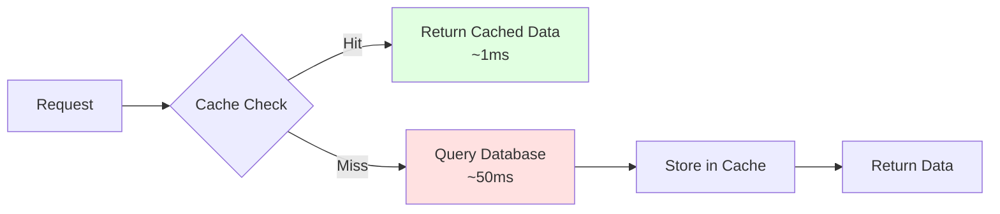

**Cache Configuration**:
- In-memory caching (MemoryCache)
- TTL: 5 minutes for read models
- Invalidation on CDC events
- Cache-aside pattern

### Scalability

**Horizontal Scaling**:
- Read Service: Multiple instances behind load balancer
- Write Service: Single instance (event sourcing consistency)
- Kafka: Multiple brokers for partitioning

**Vertical Scaling**:
- Increase container resources
- Optimize database queries
- Tune Kafka partitions

## Monitoring & Observability

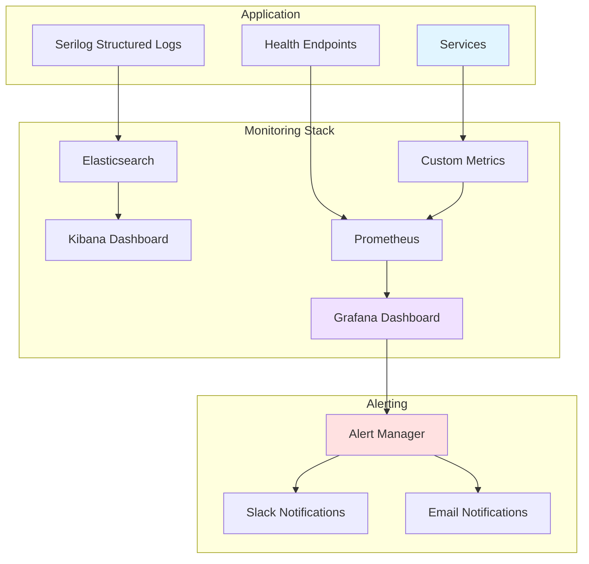

## Security

### Authentication & Authorization

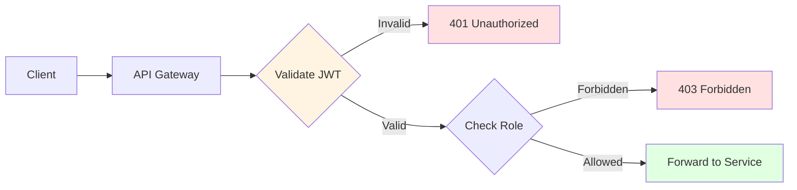

### Security Measures

- JWT-based authentication
- Role-based authorization (RBAC)
- API rate limiting
- Input validation with FluentValidation
- SQL injection prevention (parameterized queries)
- XSS protection
- CORS configuration
- HTTPS/TLS encryption
- Secret management (environment variables)
- Docker security scanning
- Dependency vulnerability scanning

## References

- [CQRS Pattern](https://martinfowler.com/bliki/CQRS.html)
- [Event Sourcing](https://martinfowler.com/eaaDev/EventSourcing.html)
- [Outbox Pattern](https://microservices.io/patterns/data/transactional-outbox.html)
- [CDC Pattern](https://en.wikipedia.org/wiki/Change_data_capture)
- [gRPC Documentation](https://grpc.io/docs/)
- [Ocelot API Gateway](https://ocelot.readthedocs.io/)
