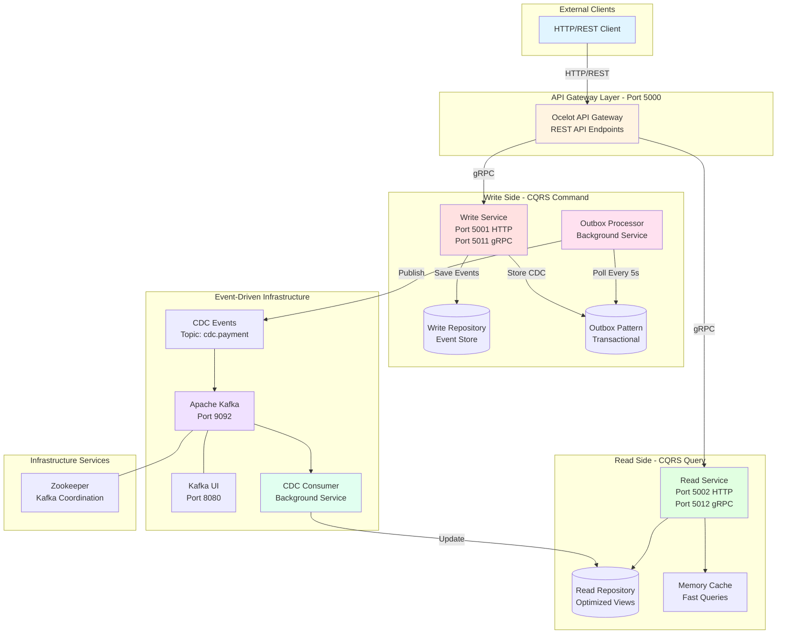
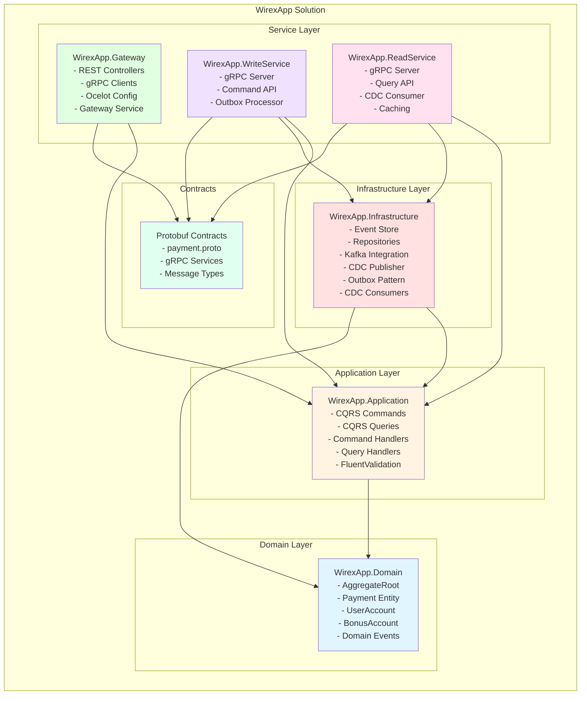
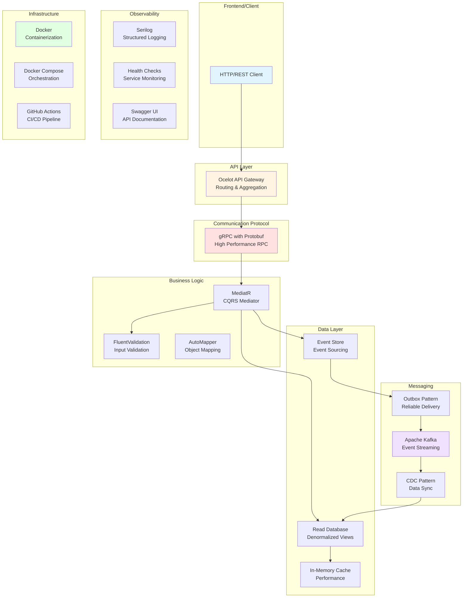
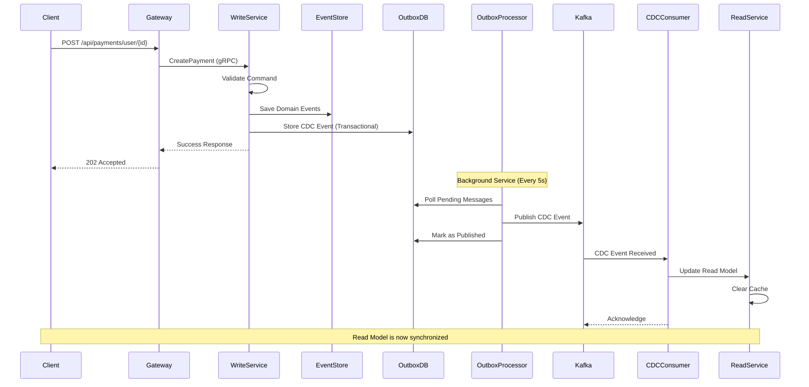
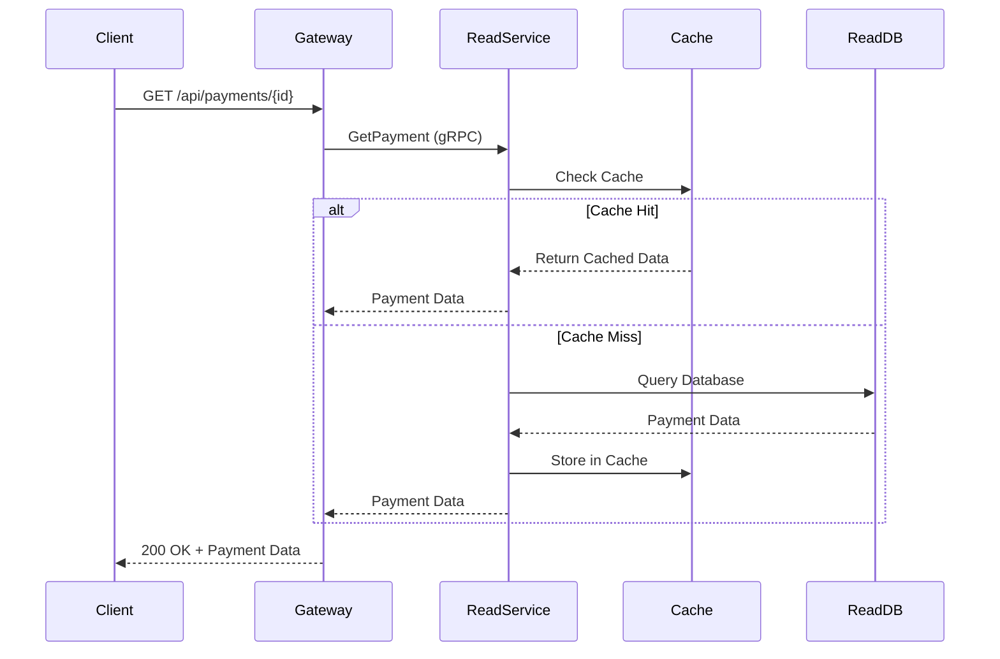

# WirexApp

Financial application with modular monolith architecture, CQRS, Kafka, and gRPC.

## Architecture



### Architecture Overview

- **API Gateway** (Port 5000) - Ocelot gateway exposing REST API, communicates via gRPC
- **Write Service** (Port 5001, gRPC 5011) - Handles commands, Event Sourcing, Outbox Pattern
- **Read Service** (Port 5002, gRPC 5012) - Handles queries, optimized for reads, caching
- **Kafka** (Port 9092) - Event-driven CDC synchronization between Write and Read
- **Kafka UI** (Port 8080) - Monitoring and management interface

### Data Flow

1. **Command Flow (Write)**:
   - Client → Gateway (REST) → Write Service (gRPC)
   - Write Service → Event Store + Outbox DB
   - Outbox Processor → Kafka (CDC Events)

2. **Query Flow (Read)**:
   - Client → Gateway (REST) → Read Service (gRPC)
   - Read Service → Cache/Read Repository

3. **Synchronization Flow**:
   - Kafka CDC Events → CDC Consumer
   - CDC Consumer → Read Repository (automatic updates)

### Key Patterns

- **CQRS**: Separate Write and Read models with physical separation
- **Event Sourcing**: All changes stored as events in Event Store
- **Outbox Pattern**: Reliable event delivery with transactional consistency
- **CDC**: Change Data Capture for automatic read model synchronization
- **API Gateway**: Single entry point with gRPC backend communication

## Project Structure



### Technology Stack Diagram



## Quick Start

```bash
# Start all services
docker-compose up --build

# Run in background
docker-compose up -d --build
```

## Verify

```bash
# Health checks
curl http://localhost:5000/health  # Gateway
curl http://localhost:5001/health  # Write Service
curl http://localhost:5002/health  # Read Service

# Access
# Gateway: http://localhost:5000 (Use this!)
# Write:   http://localhost:5001
# Read:    http://localhost:5002
```

## Sequence Diagrams

### Create Payment Flow



### Query Payment Flow



## Deployment Architecture

```mermaid
graph TB
    subgraph "Docker Host / Kubernetes Cluster"
        subgraph "Network: wirexapp-network"
            subgraph "Gateway Container"
                GW[Gateway Service<br/>:5000]
            end

            subgraph "Write Container"
                WR[Write Service<br/>:5001 (HTTP)<br/>:5011 (gRPC)]
            end

            subgraph "Read Container"
                RD[Read Service<br/>:5002 (HTTP)<br/>:5012 (gRPC)]
            end

            subgraph "Kafka Infrastructure"
                ZK[Zookeeper<br/>:2181]
                KF[Kafka Broker<br/>:9092]
                UI[Kafka UI<br/>:8080]
            end
        end

        subgraph "Volumes"
            V1[kafka-data]
            V2[zookeeper-data]
            V3[event-store-data]
        end
    end

    subgraph "External"
        LB[Load Balancer]
        Users[Users/Clients]
        GHCR[GitHub Container Registry<br/>ghcr.io]
    end

    subgraph "CI/CD"
        GHA[GitHub Actions]
        Security[Security Scanning]
    end

    Users --> LB
    LB --> GW
    GW -.gRPC.-> WR
    GW -.gRPC.-> RD
    WR --> KF
    KF --> RD
    KF --> ZK
    KF --> V1
    ZK --> V2
    WR --> V3

    GHA -->|Build & Push| GHCR
    GHA -->|Deploy| GW
    GHA -->|Deploy| WR
    GHA -->|Deploy| RD
    Security -->|Scan| GHA

    style GW fill:#fff4e1
    style WR fill:#ffe1e1
    style RD fill:#e1ffe1
    style KF fill:#f0e1ff
    style LB fill:#e1f5ff
    style GHCR fill:#ffe1f0
```

## Usage

**All requests go through the Gateway (Port 5000)**

### Create Payment
```bash
curl -X POST http://localhost:5000/api/payments/user/{userId} \
  -H "Content-Type: application/json" \
  -d '{"sourceCurrency": 1, "targetCurrency": 2, "sourceValue": 100.00}'
```

### Get Payment
```bash
curl http://localhost:5000/api/payments/{paymentId}
```

### Get All Payments
```bash
curl http://localhost:5000/api/payments
```

### Get Statistics
```bash
curl http://localhost:5000/api/payments/stats
```

## Stack

- .NET 8
- Ocelot API Gateway
- gRPC (Gateway ↔ Services)
- Kafka (CDC)
- CQRS + Event Sourcing
- Outbox Pattern
- Docker


## Stop

```bash
docker-compose down
```
