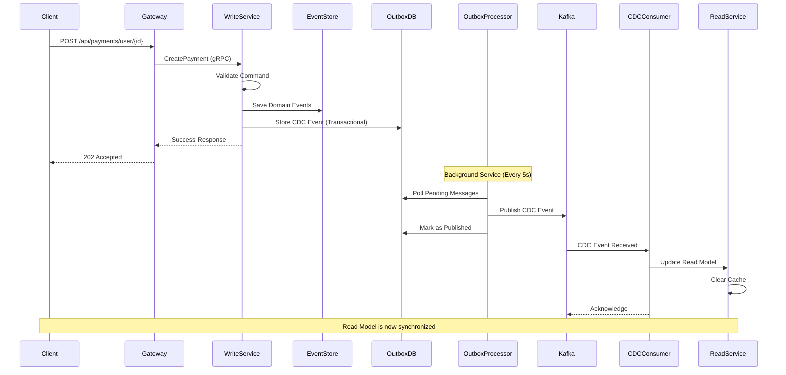
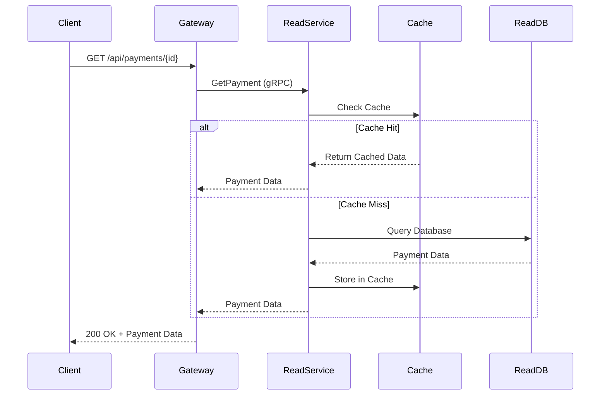

# WirexApp

Multi-currency payment processing platform with currency exchange, built using modular monolith architecture, CQRS, Event Sourcing, and CDC pattern.

## Architecture

```
DATA FLOW

        ┌──────────────────┐   HTTP/REST Request
        │  External Client │ ─────────────────────────┐
        └──────────────────┘                          │
                                                      ▼
                                                ┌──────────────┐
                                                │  API Gateway │  (Ocelot :5000)
                                                │ (REST ↔ gRPC)├──────────────────┐
                                                └──────┬───────┘                  │
                                                       │                          │
  ═══ WRITE PATH (Command) ═══                         │ gRPC                     │ gRPC  ═══ READ PATH (Query) ═══
                                                       ▼                          ▼
                                                ┌────────────────┐         ┌──────────────────┐
                                                │  WriteService  │         │   ReadService    │
                                                │ (:5001, gRPC 5011)         │ (:5002, gRPC 5012)│
                                                └───────┬────────┘         └────┬──────────┬───┘
                                                        │ tx insert             │          │
                              ┌─────────────────────────┴──────────────┐        │          │ query
                              │                                        │        ▼          ▼
                      ┌───────────────┐                          ┌───────────┐ ┌───────────┐ ┌──────────────────┐
                      │  Event Store  │                          │ Outbox DB │ │   Cache   │ │ Read Repository  │
                      │ (Write Repo)  │                          │(durable Q)│ │(in-memory)│ │ (Optimized Views)│
                      └───────────────┘                          └─────┬─────┘ └───────────┘ └──────────┬───────┘
                                                                       │ poll                         │
                                                                       ▼                              │
                                                              ┌──────────────────┐                    │
                                                              │ Outbox Processor │                    │
                                                              │ (Background Svc) │                    │
                                                              └────────┬─────────┘                    │
                                                                       │ publish                      │
                                                                       ▼                              │
                                                                ┌───────────┐                         │
  ═══ READ PATH (CDC Sync) ═══                                  │   Kafka   │                         │
                                                                │ (:9092)   │                         │
                                                                └─────┬─────┘                         │
                                                                      │ consume                       │
                                                                      ▼                               │
                                                              ┌──────────────────┐                    │
                                                              │   CDC Consumer   │                    │
                                                              │ (Background Svc) │                    │
                                                              └────────┬─────────┘                    │
                                                                       │ update                       │
                                                                       └──────────────────────────────┘
```

### Architecture Overview

- **API Gateway** (Port 5000) - Ocelot gateway exposing REST API, communicates via gRPC
- **Write Service** (Port 5001, gRPC 5011) - Handles commands, Event Sourcing, Outbox Pattern
- **Read Service** (Port 5002, gRPC 5012) - Handles queries, optimized for reads, caching
- **Kafka** (Port 9092) - Event-driven CDC synchronization between Write and Read
- **Kafka UI** (Port 8080) - Monitoring and management interface

### Data Flow

1. **Command Flow (Write)**:
   - Client → Gateway (REST) → Write Service (gRPC)
   - Write Service → Event Store + Outbox DB
   - Outbox Processor → Kafka (CDC Events)

2. **Query Flow (Read)**:
   - Client → Gateway (REST) → Read Service (gRPC)
   - Read Service → Cache/Read Repository

3. **Synchronization Flow**:
   - Kafka CDC Events → CDC Consumer
   - CDC Consumer → Read Repository (automatic updates)

### Key Patterns

- **CQRS**: Separate Write and Read models with physical separation
- **Event Sourcing**: All changes stored as events in Event Store
- **Outbox Pattern**: Reliable event delivery with transactional consistency
- **CDC**: Change Data Capture for automatic read model synchronization
- **API Gateway**: Single entry point with gRPC backend communication

## Quick Start

```bash
# Start all services
docker-compose up --build

# Run in background
docker-compose up -d --build
```

## Verify

```bash
# Health checks
curl http://localhost:5000/health  # Gateway
curl http://localhost:5001/health  # Write Service
curl http://localhost:5002/health  # Read Service

# Access
# Gateway: http://localhost:5000 (Use this!)
# Write:   http://localhost:5001
# Read:    http://localhost:5002
```

## Sequence Diagrams

### Create Payment Flow


```mermaid
sequenceDiagram
    participant Client
    participant Gateway
    participant WriteService
    participant EventStore
    participant OutboxDB
    participant OutboxProcessor
    participant Kafka
    participant CDCConsumer
    participant ReadService

    Client->>Gateway: POST /api/payments/user/{id}
    Gateway->>WriteService: CreatePayment (gRPC)
    WriteService->>WriteService: Validate Command
    WriteService->>EventStore: Save Domain Events
    WriteService->>OutboxDB: Store CDC Event (Transactional)
    WriteService-->>Gateway: Success Response
    Gateway-->>Client: 202 Accepted

    Note over OutboxProcessor: Background Service (Every 5s)
    OutboxProcessor->>OutboxDB: Poll Pending Messages
    OutboxProcessor->>Kafka: Publish CDC Event
    OutboxProcessor->>OutboxDB: Mark as Published

    Kafka->>CDCConsumer: CDC Event Received
    CDCConsumer->>ReadService: Update Read Model
    ReadService->>ReadService: Clear Cache
    CDCConsumer-->>Kafka: Acknowledge

    Note over Client,ReadService: Read Model is now synchronized
```

### Query Payment Flow


```mermaid
sequenceDiagram
    participant Client
    participant Gateway
    participant ReadService
    participant Cache
    participant ReadDB

    Client->>Gateway: GET /api/payments/{id}
    Gateway->>ReadService: GetPayment (gRPC)
    ReadService->>Cache: Check Cache

    alt Cache Hit
        Cache-->>ReadService: Return Cached Data
        ReadService-->>Gateway: Payment Data
    else Cache Miss
        ReadService->>ReadDB: Query Database
        ReadDB-->>ReadService: Payment Data
        ReadService->>Cache: Store in Cache
        ReadService-->>Gateway: Payment Data
    end

    Gateway-->>Client: 200 OK + Payment Data
```

## Usage

**All requests go through the Gateway (Port 5000)**

### Create Payment
```bash
curl -X POST http://localhost:5000/api/payments/user/{userId} \
  -H "Content-Type: application/json" \
  -d '{"sourceCurrency": 1, "targetCurrency": 2, "sourceValue": 100.00}'
```

### Get Payment
```bash
curl http://localhost:5000/api/payments/{paymentId}
```

### Get All Payments
```bash
curl http://localhost:5000/api/payments
```

### Get Statistics
```bash
curl http://localhost:5000/api/payments/stats
```

## Stack

- .NET 8
- Ocelot API Gateway
- gRPC (Gateway ↔ Services)
- Kafka (CDC)
- CQRS + Event Sourcing
- Outbox Pattern
- Docker


## Stop

```bash
docker-compose down
```
